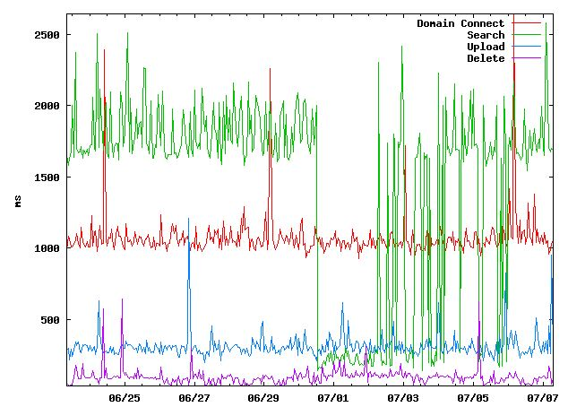

# FileNet P8 HealthCheck Utility

This utility performs lower level functional testing on FileNet P8 Content Platform Engine object stores and alerts if any issues are encountered.  It is intended to be invoked as a cron job at regular intervals.

Each operation is timed and written to a .csv file, which we can send out metrics on.

Supported operations:
* Connection to P8 Domain
* Document search (each Object Store)
* Document upload (each Object Store)
* Document deletion (each Object Store)
* Identify expired queueitem entries (each Object Store)

## Prereqs

The utility requires the references to the FileNet P8 Content Platform Engine API, including:

* listener.jar
* Jace.jar
* log4j.jar
* stax-api.jar
* xlxpScanner.jar
* xlxpScannerUtils.jar
* javax.mail.jar

## Manifest

The core of the project resides in HealthCheck.java.  The encryption piece in AESencrp.java is taken from [here.](http://www.code2learn.com/2011/06/encryption-and-decryption-of-data-using.html)

* **AESencrypt.java** encrypting credentials
* **SendEmail.java** hmmm I wonder
* **HealthCheck.java** core of project code
* **config.properties** variables and connection info
* **runHealthCheck.sh** run from cron using JRE
* **plotTrends.sh** build and send trending graph from .csv (requires gnuplot)

## Trending

The following is a sample of the trending graph we generate with gnuplots and distribute.

